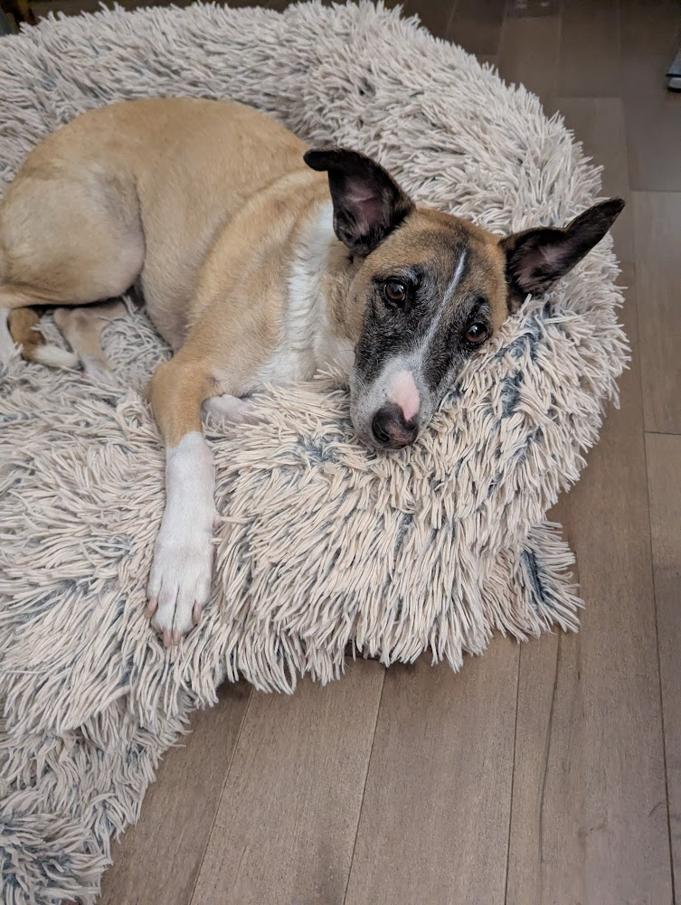

```{r setup, include=FALSE}
knitr::opts_chunk$set(echo = FALSE)
```

```{r logo, out.width='10%', fig.align='center'}

```

## La structure d'un document R Markdown

Donc, un document R Markdown est essentiellement un fichier texte avec l'extension `.Rmd` qui combine du texte écrit en Markdown et des blocs de code R. Ici nous allons explorer les principales composantes d'un document `.Rmd`.

Pour de l'aide ou des documents de référence :

- La _cheatsheet_ officielle de rmarkdown : 
  - Help > Cheatsheets > R Markdown Cheat Sheet
  - Ou [ici](https://raw.githubusercontent.com/rstudio/cheatsheets/main/rmarkdown.pdf)
- Le manuel de référence officiel pour Markdown :
  - Help > Markdown Reference
- Un manuel plus complet pour R Markdown :
  - [R Markdown: The Definitive Guide](https://bookdown.org/yihui/rmarkdown/)
- Le site web de R Markdown :
  - [R Markdown](https://rmarkdown.rstudio.com/lesson-1.html)

Pour ouvrir un nouveau document `.Rmd`
- File > New File > R Markdown...

Pour interpréter et générer le document final, on "tricote" le document en utilisant le bouton `Knit` dans RStudio.

On n'a pas besoin d'indiquer un répertoire de travail (`setwd()`, _working directory_) lorsqu'on utilise R Markdown, car le répertoire de travail est automatiquement défini comme le dossier contenant le fichier `.Rmd`.

### YAML

Un document `.Rmd` débute typiquement par un bloc de données dans un format spécifique: **YAML** (*Yet Another Markup Langage*). C'est un format de données, souvent utilisé pour la configuration de fichiers. Dans un document R Markdown, le bloc YAML est utilisé pour définir les métadonnées du document (titre, auteur(s), date, etc.) mais aussi le format de sortie ainsi que d'autres paramètres additionnels lorsque requis.

Ce bloc peut être très minimaliste pour des documents relativement simples, mais se complexifie au fur et à mesure que les besoins du document augmentent. 

### Écrire et formater du texte :

Il ne sert à rien d'écrire du code R directement dans un fichier R Markdown, il ne sera pas interprété comme tel. Pour être interprété, le code doit être inséré avec des blocs de code que nous introduirons plus tard.

ex. les commandes suivantes ne seront pas interprétées comme du code

library(dplyr)
x <- 2+3

C'est **le texte** que l'on écrit directement dans un document `.Rmd`, en utilisant la syntaxe Markdown pour le formatter. 

Voici les éléments essentiels à connaître de la syntaxe Markdown:

- Pour définir les sections avec titres et sous-titres, utilisez des dièses (`#`):
  - `# Titre de niveau 1`
  - `## Titre de niveau 2`
  - `### Titre de niveau 3`
  - Et ainsi de suite jusqu'à six niveaux (`###### Titre de niveau 6`)
  - On peut accéder au plan du document via l'onglet "Outline" dans RStudio (en haut à droite par défaut)
- Pour **mettre en gras**, encadrez le texte avec deux astérisques (`**`): `**texte en gras**`
- Pour *mettre en italique*, encadrez le texte avec un astérisque (`*`): `*texte en italique*`
  - on peut aussi utiliser des _underscores_ `_` pour le même effet
- Pour créer des listes à puces, utilisez des tirets (`-`) ou des astérisques (`*`):
  - Il est important de laisser un espace après le tiret ou l'astérisque.
  - Les niveaux sont déterminés par l'indentation.
- Pour créer des listes numérotées, utilisez des chiffres suivis d'un point (`1.`, `2.`, etc.):
  1. Comme pour les listes à puces, laissez un espace après le numéro.
  2. Les niveaux sont également déterminés par l'indentation.
- Pour insérer des liens, utilisez la syntaxe `[texte du lien](URL)`: `[RStudio](https://www.rstudio.com/)`
- Pour insérer des images, plusieurs options existent, la façon 'native' en markdown est :
  - `` -- (ne pas confondre avec le `!` de *R*)
  - Il est préférable d'utiliser la fonction `knitr::include_graphics()` dans un bloc de code R (nous y reviendrons) pour plus de contrôle.

On reste dans la simplicité! C'est ce qui fait la popularité de Markdown (et sa transportabilité).

#### HTML vs PDF (LaTex)

Markdown est conçu pour être converti en HTML, mais il peut également être converti en d'autres formats comme PDF (via LaTeX) ou Word. Certaines fonctionnalités de Markdown peuvent ne pas être entièrement compatibles avec tous les formats de sortie. Par exemple, les tableaux complexes ou les formules mathématiques peuvent nécessiter des ajustements spécifiques selon le format de sortie choisi.

Aussi Markdown reste un language de balisage très minimaliste, donc lorsqu'on va vouloir effectuer des mises en forme plus complexes, on va devoir recourir à du HTML (pour la sortie HTML) ou du LaTeX (pour la sortie PDF), mais préférablement utiliser des fonctionnalités compatibles avec les deux.

Donc il est bon de bien s'assurer de connaître le format de sortie final avant de se lancer dans la rédaction d'un document complexe.

Par exemple :

Aussi surprenant que ça puisse paraître, Markdown ne permet pas nativement de centrer des images. Donc si on veut centrer une image importée, il va falloir la combiner avec du html ou du LaTex.

##### A- HTML
<div style="text-align: center;">
  
</div>

<br><br><br>
\vspace{3em}

##### B- LaTex
\begin{center}
  \includegraphics[width=0.4\textwidth]{Gus.jpg}
  \\
  \textbf{Gus}
\end{center}

<br><br><br>
\vspace{3em}

##### C- Version universelle avec knitr - un package R
```{r, out.width='150px', fig.align='center', fig.cap='Carte de France'}

```

Et si on exporte en format `Word`?

Aussi Markdown ne permet pas de changer la couleur du texte nativement.
Il faut encore une fois recourir à du <span style="color: red;">HTML</span> ou du \textcolor{blue}{LaTeX.}


### Un exercice de mise en pratique

- Créer un nouveau document `.Rmd`
  - Ajouter un bloc YAML avec les métadonnées complètes.
  - Ajouter trois niveaux de titres.
  - Ajouter du texte sous la première section, en utilisant du gras, de l'italique et des couleurs.
  - Ajouter une liste à puces sous la deuxième section.
  - Chercher une image en ligne et l'insérer sous la troisième section.
  - Insérer un saut à la ligne, puis ajouter l'URL dirigeant vers l'image d'origine.
- Le "tricoter" (*knit*) dans un des trois formats offerts par défaut (HTML, PDF, Word).

Dans le doute, consulter les sources d'aide présentées plus haut!

